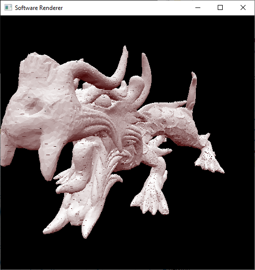
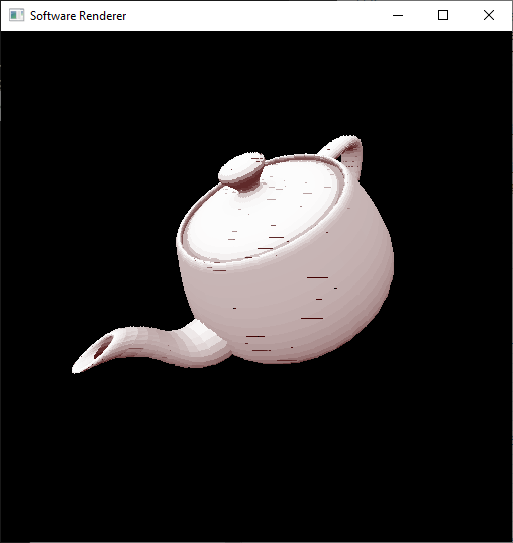
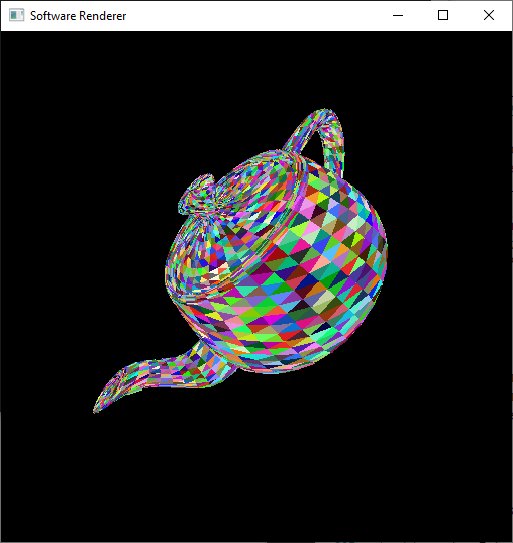

# 🎥 software-renderer
A software renderer built in C++17 using SDL2-2.0.14.

# 👉 [Run it Online at jonahsussman.net!](https://www.jonahsussman.net/projects/software-renderer) 👈

# 🎮 Controls

WASD to move around, Q and E to move up and down. Use IJKL to look around and U and O to rotate your view.

# 🖼&#xFE0F; Gallery

# 💻 Requirements

Tested compilation on linux with `x86_64-w64-mingw32-g++`. You must have SDL2 installed, and copied the SDL2 development libraries to the `lib` directory in this project. Afterwards, you simply run `make all` in the main directory.

# 📜 Licence

This software is released under the MIT License. See the [LICENSE](LICENSE) file for more information.